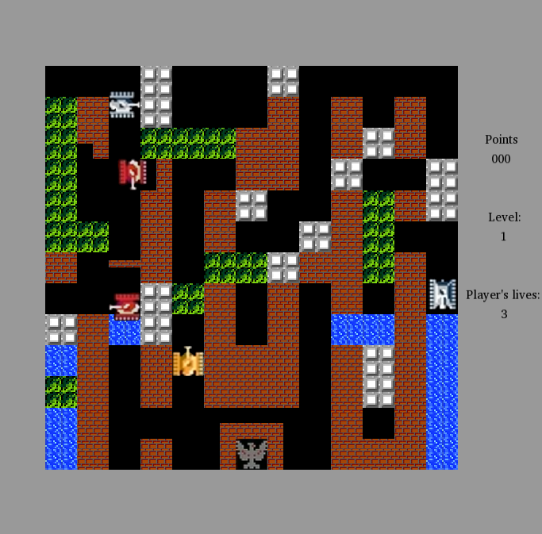

# Battle-city
A simple [Battle City](https://en.wikipedia.org/wiki/Battle_City) clone. Forked from my 2nd semester OOP project. Utilizes a custom event generation and handling system with a simple event loop. Graphics provided with SFML, testing done with Catch2.




### Build
Build with CMake:
```sh
# READ NOTE!
mkdir build && cd build
cmake ../
make
```
SFML and Catch2 dependencies are fetched by CMake.

**NOTE** - building SFML from source will (most likely) require to manually install some additional dependencies - as SMFL doc states:
> On Linux however, nothing is provided. SFML relies on you to install all of its dependencies on your own. Here is a list of what you need to install before building SFML:

For a Debian-based system, execute:
```sh
apt-get install         \
    libfreetype6-dev    \
    libx11-dev          \
    libxrandr-dev       \
    libgl1-mesa-dev     \
    libudev-dev         \
    libopenal-dev       \
    libflac-dev         \
    libogg-dev          \
    libvorbis-dev
```
If you are on a RHEL-based distro, try this instead:
```sh
dnf install             \
    freetype-devel      \
    libX11-devel        \
    libXrandr-devel     \
    mesa-libGL-devel    \
    libgudev1-devel     \
    openal-devel        \
    flac-devel          \
    libogg-devel        \
    vorbis-devel
```

Alternatively, you can try downloading the entire SFML using your system's package manager (`libsfml-dev` / `libsfml-devel`). In that case, [CMakeLists.txt](CMakeLists.txt) should be modified to utilize globally installed SFML.

### Documentation
Auto-generated with Doxygen, available in [/doc](doc):
```bash
cd ./doc/html/
opera ./index.html
```
